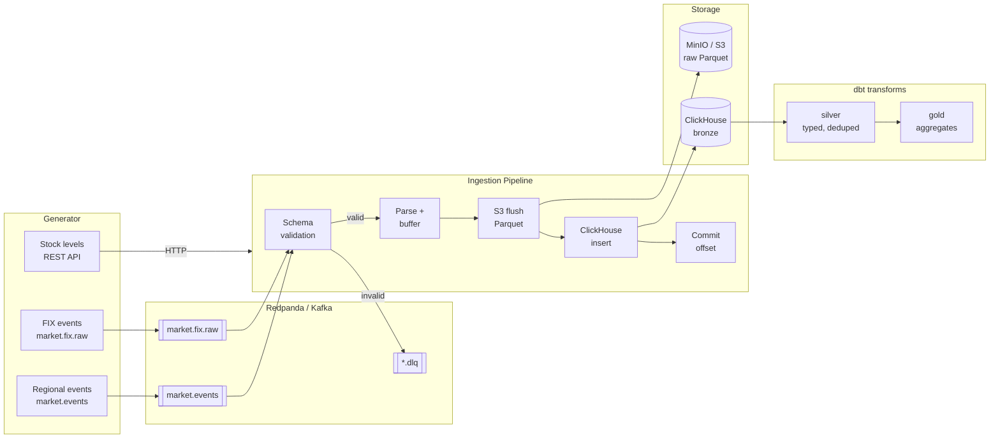
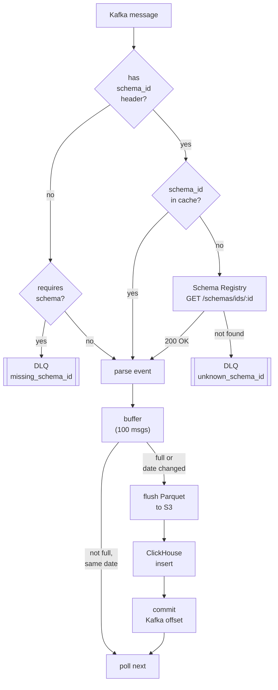

# metals-data-platform

A local proof-of-concept data platform for commodity market data, built to explore ingestion, replay, and idempotency patterns. Runs on a laptop with Docker.

## Overview

A generator produces synthetic trading data. A pipeline ingests it via Kafka, stores raw events as immutable Parquet files in object storage, loads them into ClickHouse, and transforms them through bronze → silver → gold layers using dbt.

| Data                             | Shape                   | Transport        |
|----------------------------------|-------------------------|------------------|
| Trades (FIX messages)            | unstructured text       | Kafka / Redpanda |
| Trade details                    | semi-structured JSON    | Kafka / Redpanda |
| Warehouse and barge stock levels | structured              | REST API         |
| Barge positions                  | geospatial, batch files | Kafka / Redpanda |

## Architecture





## Architectural decisions

### Idempotency

Every event carries a natural business key (`execution_id`). Duplicates and re-deliveries are handled at two levels:

- **Transport**: Kafka at-least-once delivery with manual offset commit — offset is committed only after successful S3 write and ClickHouse insert
- **Storage**: bronze uses MergeTree (not ReplacingMergeTree) — deduplication is explicit, handled in the silver layer via `QUALIFY ROW_NUMBER() OVER (PARTITION BY execution_id ...)`

This makes deduplication visible and testable rather than relying on engine-level magic.

### Replay

Raw events are written as immutable Parquet files in S3, partitioned by topic and event date. Each flush produces a new uniquely-named file — nothing is ever overwritten:

```
{topic}/{YYYY-MM-DD}/{timestamp_ms}.parquet   ← written by pipeline (append)
{topic}/{YYYY-MM-DD}/compacted.parquet        ← written by compaction job (daily)
```

A nightly compaction job (`ingestion/compaction.py`) merges all flush files for the previous day into a single `compacted.parquet` and deletes the originals. This keeps S3 tidy without sacrificing immutability during the day.

Any downstream table (silver, gold) can be fully rebuilt by truncating it and replaying from bronze:
```bash
# truncate silver
curl -X POST "http://localhost:8123/" -u "default:clickhouse" --data "TRUNCATE TABLE silver.fix_events"
# rebuild
dbt run
```

**Production compaction:** run as a cron job at 00:05 UTC daily (5 minutes after midnight to let any late-arriving events land):
```bash
5 0 * * * cd /app && python -m ingestion.compaction
```
Or for a specific date:
```bash
make compact DATE=2026-10-07
```

### Delivery guarantee

The pipeline commits Kafka offsets only after data has been written to both S3 and ClickHouse. If either write fails, the offset is not committed and the messages are reprocessed on restart. This guarantees at-least-once delivery end-to-end.

### Data lineage

Every row in every layer carries `source_file` (S3 path of the Parquet file it came from) and `pipeline_version`. This makes it possible to trace any row back to its origin and understand which pipeline version produced it.

## Ingestion pipeline

The pipeline runs as a single orchestrated process (`python -m ingestion.pipeline`). Each Kafka topic has a dedicated worker thread:

```
Kafka poll → parse → buffer (100 messages) → S3 flush → ClickHouse insert → commit offset
```

**Partition strategy:**
- `market.fix.raw` — 4 partitions, key: `metal_id`
- `market.events` — 4 partitions, key: `metal_id_region`
- 2 active partitions per topic now, 2 reserved for horizontal scaling

**Error handling:**
- Graceful shutdown on Ctrl+C: buffer flushed before exit
- Worker crash recovery: automatic restart after 5 seconds
- S3 write retry: up to 3 attempts with exponential backoff
- Offset commit only after successful S3 + CH write

**Schema validation and DLQ:**

Both topics validate incoming messages against a Schema Registry before processing. Each message must carry a `schema_id` header; messages that are missing it or reference an unknown schema are routed to a dead-letter topic instead of being processed.

| Topic | Schema ID | DLQ topic |
|-------|-----------|-----------|
| `market.fix.raw` | 2 | `market.fix.raw.dlq` |
| `market.events` | 1 | `market.events.dlq` |

Schema IDs are registered once at setup:
```bash
make register-schemas
```

The `SchemaRegistryClient` caches known IDs in memory — Registry is only hit once per unique schema_id. DLQ messages carry an extra `dlq_reason` header (`missing_schema_id` or `unknown_schema_id:<id>`) for inspection.

## Data models

Transformations are managed with **dbt** in `transforms/`. Three layers:

**Bronze** — raw data as-is from Parquet. No casting, no renaming. Lineage columns `source_file` and `pipeline_version` added at load time.

**Silver** — typed, renamed, deduplicated. FIX protocol tags mapped to human-readable names. Timestamps parsed from FIX format (`YYYYMMDD-HH:MM:SS.mmm`). Deduplication via `QUALIFY ROW_NUMBER()` on natural key.

**Gold** — aggregates for analytics: daily trade volume, regional price summary, delivery summary.

### conditions field versioning

Currently `conditions` is a single JSON object per event (one warehouse). Silver flattens it to `region`, `warehouse_id`, `warehouse_city`.

The intended production shape is a list of objects (multiple warehouses per event). Migration path:

**Phase 1 — dual read in silver (backwards compatible):**
- Silver detects schema version via `schema_version` from bronze
- `v1`: flat extraction via `JSONExtractString`
- `v2`: array extraction via `JSONExtract` + `arrayMap`
- Both versions coexist, no downstream breakage

**Phase 2 — generator migration:**
- Generator emits `conditions` as JSON array with `schema_version: 2`
- Bronze unchanged — stores raw JSON as-is
- Silver processes v1 and v2 simultaneously

**Phase 3 — cutover:**
- Drop v1 branch from silver once all bronze data is v2
- Replay from bronze to reconstruct silver fully

## Performance

Measured on a laptop (Apple M-series, Docker).

**Kafka → ClickHouse (pipeline):**
| Metric | Value |
|--------|-------|
| Throughput — backlog catch-up | ~265–446 msg/sec |
| Throughput — steady state | ~36 msg/sec total (~18 per topic) |
| Message parse time | < 0.2 ms |
| S3 write (100 messages, ~7 KB) | 5–15 ms |
| ClickHouse insert (100 rows) | 55–70 ms |
| Schema Registry validation overhead | negligible (cached after first lookup) |

**End-to-end latency (event → visible in ClickHouse):**
| Load | Latency |
|------|---------|
| Steady state (~36 msg/sec) | ~2–4 sec |
| Peak load (40 msg/sec total) | ~5 sec |
| Backlog catch-up | < 100 ms per batch |

Latency is dominated by buffer fill time (100 messages). To reduce latency at peak load, lower the buffer size from 100 to 20–50 messages — trades higher S3/CH call frequency for lower latency.

## Quick start

**1. Start the stack**
```bash
make up
```

**2. Create topics**
```bash
make topics
```

**3. Start the generator** (terminal 1)
```bash
make generator
```

**4. Start the pipeline** (terminal 2)
```bash
python -m ingestion.pipeline
```

**5. Run compaction** (merges today's flush files into one, deletes originals)
```bash
make compact DATE=2026-10-08
```

**6. Run dbt transformations**
```bash
cd transforms && dbt run
```

**6. Check Redpanda Console**

Open http://localhost:8080

**7. Verify data in object storage**
```bash
aws --endpoint-url http://localhost:8333 s3 ls s3://raw-events/ --recursive
```

**8. Tear down**
```bash
make down
```

## Events structure

### FIX event

```json
{
  "topic": "market.fix.raw",
  "key": "AH",
  "value": "8=FIX.4.4|35=8|34=2052|52=20261005-21:12:26.047|17=EX-002052|55=AH|54=1|32=33|31=2664.29|60=20261005-21:04:16.047|",
  "headers": [
    {"key": "event_type", "value": "trade_execution_report"},
    {"key": "schema_version", "value": "1"},
    {"key": "source", "value": "synthetic_fix"},
    {"key": "content_type", "value": "text/plain"},
    {"key": "idempotency_key", "value": "EX-002052"}
  ],
  "timestamp": 1791234746047,
  "partition": 0,
  "offset": 9
}
```

### Regional event

```json
{
  "topic": "market.events",
  "key": "PB_ME",
  "value": "{\"event_type\": \"regional_price_quote\", \"schema_version\": 1, \"execution_id\": \"EX-ME-2039\", \"instrument\": \"PB\", \"side\": \"sell\", \"quantity\": 24, \"price\": 2196.44, \"currency\": \"USD\", \"event_timestamp\": \"20261005-21:11:47.968\", \"conditions\": {\"region\": \"Middle East\", \"warehouse\": {\"warehouse_id\": \"WH_DBX\", \"city\": \"Dubai\"}}}",
  "headers": [
    {"key": "event_type", "value": "regional_price_quote"},
    {"key": "schema_version", "value": "1"},
    {"key": "source", "value": "synthetic_regional_market"},
    {"key": "content_type", "value": "application/json"},
    {"key": "idempotency_key", "value": "EX-ME-2039"}
  ],
  "timestamp": 1791234707968,
  "partition": 0,
  "offset": 9
}
```

## Roadmap

- [x] Data generator
- [x] Kafka / Redpanda locally
- [x] Ingestion pipeline — Kafka → S3 → ClickHouse bronze
- [x] Schema Registry + DLQ
- [x] Immutable Parquet with daily compaction
- [x] Silver layer (dbt)
- [ ] Gold layer (dbt)
- [ ] Spark and Iceberg experiments
- [ ] API data processing
